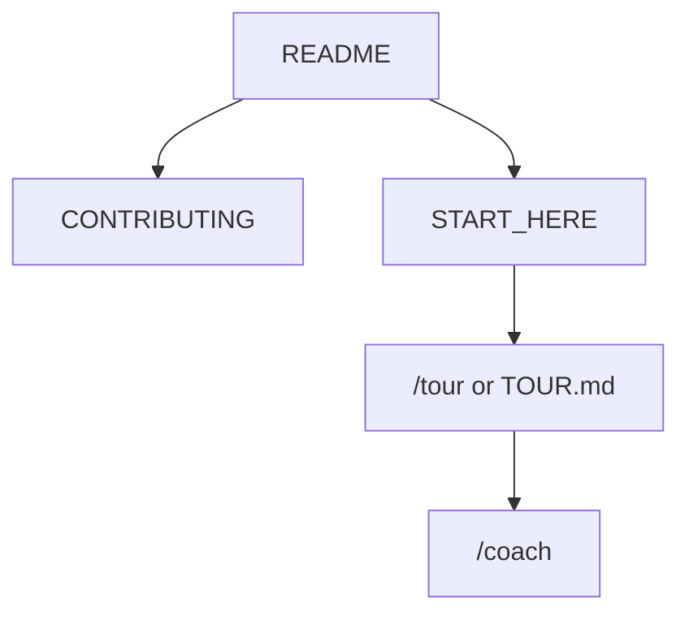

<!-- GENERATED by scripts/generate-project-readme.py — edit branding/product.json -->

  

<h1 align="center">SyncMark</h1>

<strong>Your bookmarks, one folder, every browser — no account required</strong>

  
  
  
  
  
  
  
  
  
  
  
  
  

  
  
  

## Pitch

SyncMark is a local-first browser extension that unifies bookmarks across Chrome, Edge, Firefox, and friends. Point it at a folder you own, import existing bookmarks, check dead links, accept or reject category suggestions, and pair other browsers with a short code. No login, no project-operated cloud — your links stay on disk under your control.

## Demo

  

> Add screenshots or a short demo GIF under `docs/images/` and link them here when available.

## Features

- Unify bookmarks from multiple browsers into one user-owned folder
- Pair additional browsers with a short code — no accounts or OAuth
- Dead-link health status that never auto-deletes your bookmarks
- Category and tag suggestions you always confirm before applying
- Export to HTML, JSON, or Markdown; works offline by default

## Quick start

1. Clone the repo and open `extension/` (Node 20+).
2. Run `npm install` then `npm test` and `npm run build`.
3. Load the unpacked build in Chrome/Edge (`dist/chromium`) or Firefox (`dist/firefox`).
4. Create or open a SyncMark **data** folder, then **Sync now** — builds on your existing bookmark folders (no zip; no SyncMark mirror dump).
5. Firefox: open the same data folder via **Open SyncMark folder (Firefox)** when exchanging the on-disk database; Sync Now still updates browser folders in place.

## For humans

Start with this README, then [`CONTRIBUTING.md`](CONTRIBUTING.md) and [`docs/BEST_PRACTICES.md`](docs/BEST_PRACTICES.md). The first-month playbook is [`docs/FIRST_30_DAYS.md`](docs/FIRST_30_DAYS.md).

## For agents

Read [`docs/START_HERE.md`](docs/START_HERE.md) and [`AGENTS.md`](AGENTS.md). In Cursor type `/tour` or `/bootstrap`. Any other IDE: ask the agent to read [`docs/help/TOUR.md`](docs/help/TOUR.md). `/coach` is the next recommended action.

## Install

Node 20+ for building the extension. Load unpacked from `extension/dist/chromium` or `extension/dist/firefox`. See `extension/README.md` and `modules/web/MODULE.md`.

## Usage

Create or open a SyncMark folder in Options, import bookmarks, share a pairing code with another browser pointing at the same (or Syncthing/Dropbox-synced) folder. Use Review to accept category suggestions; run Check links on demand. Export anytime from Options.

## Configuration

Copy [`.env.example`](.env.example) to `.env` for local secrets (never commit `.env`). Stack-specific config lives in the active `examples/` or app root after prune.

## Contributing

See [`CONTRIBUTING.md`](CONTRIBUTING.md). Prefer small PRs; follow Conventional Commits and the BUILD_PLAN labels (`AGENT` / `HUMAN` / `ADB` / `AUTO`). Status markers: 🔲 open · ✅ done · ❌ blocked.

## Security

See [`SECURITY.md`](SECURITY.md). Enable Dependabot alerts and follow [`docs/SECURITY_TRIAGE.md`](docs/SECURITY_TRIAGE.md) for weekly CVE triage.

## License

[MIT License](LICENSE) — see the license file for terms.

## Acknowledgments

Scaffolded with [agent-project-bootstrap](https://github.com/edwardlthompson/agent-project-bootstrap). Brand assets: [`branding/BRANDING.md`](branding/BRANDING.md). Design system: [`docs/DESIGN_GUIDE.md`](docs/DESIGN_GUIDE.md).
