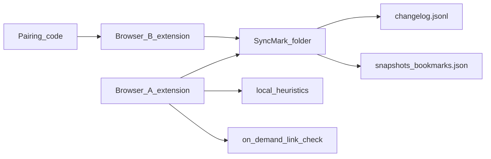

# Product Specification — SyncMark

> Status markers: 🔲 open · ✅ done · ❌ blocked.
> Feature slices: `docs/features/{name}.md`.

## Overview

<!-- product-brief-sync:begin -->
> Read `AGENT.md` before any sprint row.

**One-liner:** Local-first, self-hosted browser extension that unifies bookmarks across browsers, checks dead links, suggests categories, and syncs via a user-owned folder + pairing code — no accounts, no cloud required.
**Do not drift:** local-first, self-hosted, browser-extension, webextensions, bookmarks, dead-link-checker, category-suggestions, folder-sync, pairing-code, p2p-ish, privacy, foss, no-cloud, no-login

**Rules:**
- Pure FOSS under MIT. No proprietary SDKs, no mandatory cloud, no user accounts, no OAuth in the core product.
- Local-first: all bookmark data lives in a user-chosen folder on disk. The extension never sends bookmark content to any remote server operated by the project.
- Pairing is done with a short human-enterable code (or QR) that lets another browser/device join the same SyncMark space by pointing at the same (or synced) folder and sharing a secret for integrity.
- Auto-categorization only **suggests**; the user always makes the final decision. Suggestions appear on every new save and in a bulk “Review existing bookmarks” flow.
- Target mainstream users who hop between browsers and devices. Prefer simple, obvious UX over power-user complexity in v1.
- Follow every rule in the parent template’s `AGENTS.md`, `docs/INITIALIZATION_PROMPT.md`, `docs/ux-ui-guidelines.md`, file-size budgets, test-first policy, Conventional Commits, and security defaults.
- After `init-project`, keep this file as the Sacred product brief. Update `docs/spec.md`, `docs/plan.md`, and `BUILD_PLAN.md` from it; do not let the product drift.

**First milestone:** 1. Scaffold the extension (Chromium + Firefox) that can request a folder and write a minimal SyncMark data structure into it.
<!-- product-brief-sync:end -->

**Product:** SyncMark  
**Purpose:** Give anyone a single, healthy, organized bookmark collection across Chrome, Edge, Firefox, Brave, and Opera without an account or cloud upload.  
**Users:** Mainstream people who hop between browsers/devices and refuse another login.

## Functional Requirements & User Stories

| ID | Story | Acceptance |
|----|-------|------------|
| FR-1 | As a user I create or open a SyncMark folder so my bookmarks live on disk I control | `space.json` + changelog + snapshot written; reopen restores the space |
| FR-2 | As a user I import this browser’s bookmarks into the space | Bookmarks appear in the unified list; duplicates by normalised URL are merged |
| FR-3 | As a user I pair a second browser with a short code | Join verifies secret against `space.json` in the selected folder; no account created |
| FR-4 | As a user I save a bookmark and see category suggestions | Suggestions shown; nothing moves until I confirm or keep current |
| FR-5 | As a user I review existing bookmarks for suggested categories | Accept / keep current per item; bulk review never auto-applies |
| FR-6 | As a user I check links on demand | Health status stored in `health.json`; dead status never deletes bookmarks |
| FR-7 | As a user I search and export | Search filters the list; export produces HTML, JSON, or Markdown |

## Non-Functional Constraints

- MIT FOSS; no proprietary SDKs on the production path
- Offline-first: core create/import/suggest/export work with zero network
- Dead-link checks are optional, rate-limited, and non-destructive
- No telemetry by default; no project-operated bookmark servers
- File budgets: 300 lines static data, 150 lines pure logic where practical
- Strict TypeScript; test-first for core modules

## Folder layout (on-disk protocol)

Logical layout (also embedded in a portable `*.syncmark.json` bundle for cross-browser open/join):

```
<SyncMarkRoot>/
  space.json              # id, name, secretHash, createdAt, version
  changelog.jsonl         # append-only mutation events
  snapshots/
    bookmarks.json        # materialised Bookmark[]
  health.json             # { [bookmarkId]: HealthRecord }
```

MVP packaging: the extension persists an active space in extension storage and **Download SyncMark file** writes a single JSON bundle containing `space`, `bookmarks`, `changelog`, `health`, and (when available) `pairingSecret` for the owner. Place that file in a user-synced folder (Syncthing, Dropbox, etc.) to share across devices.

### Pairing protocol

1. **Create:** generate `spaceId` (10 Crockford chars) + `secret` (16 Crockford chars). Store `secretHash = SHA-256(secret)` in `space.json`. Display pairing code as `SM-XXXXXXXXXX-XXXXXXXXXXXXXXXX` (id + secret groups).
2. **Join:** user enters code and opens the SyncMark file. Decode id+secret; require matching `id` and `secretHash`.
3. No SyncMark server participates. Cross-device sync relies on the user’s own folder sync tools.

## Architecture & Data Flow



See [`docs/adr/0010-local-folder-pairing.md`](adr/0010-local-folder-pairing.md).

## Test-first rule

Every feature in `docs/plan.md` / BUILD_PLAN must list tests, or state why automation is not feasible and name the fallback command.
